<div align="center">

# Video2SubAct: Composable Robot Manipulation from Human Demonstrations via Primitive Task Inference

**Collapse a video clip into a single image, then classify it with a frozen CNN.**

*Official implementation for* ***Video2SubAct: Composable Robot Manipulation from Human Demonstrations via Primitive Task Inference*** *(Autonomous Robots, 2026).*

<p>
  
  
  
  
  
  
</p>

</div>

---

## Overview

**Video2SubAct** is a video-to-robot learning framework that enables robots to perform **previously unseen manipulation tasks from a single human demonstration** using reusable manipulation primitives. Instead of learning task-specific policies, the framework learns a library of primitive actions (**Reach, Pick, Move, Place, Tilt, Retract,** and **Wipe**) once through offline training and reuses them to compose new tasks without retraining.

The pipeline automatically segments continuous human demonstrations into primitive-level actions using object-centric trajectory analysis, recognizes each primitive with the proposed lightweight **V-DNN** classifier, and executes the corresponding robot motions through the **Dynamic Adaptive Trajectory Radial Network (DATRN)**.

The proposed V-DNN achieves **96.7%** primitive classification accuracy while significantly outperforming ViViT, VideoMAE, and several CNN baselines with a much smaller classification head. On continuous task demonstrations, the complete Video2SubAct pipeline achieves **83.2%** primitive recognition accuracy and **82.5%** end-to-end task execution success on a **Kinova Gen3** robotic manipulator across multiple unseen task compositions.


---

## Sub-Task Primitives

Each continuous demonstration is segmented into short **sub-action primitives**. Below is one sample clip per primitive class.

<div align="center">

| Move | Pick | Place | Reach |
|:---:|:---:|:---:|:---:|
| 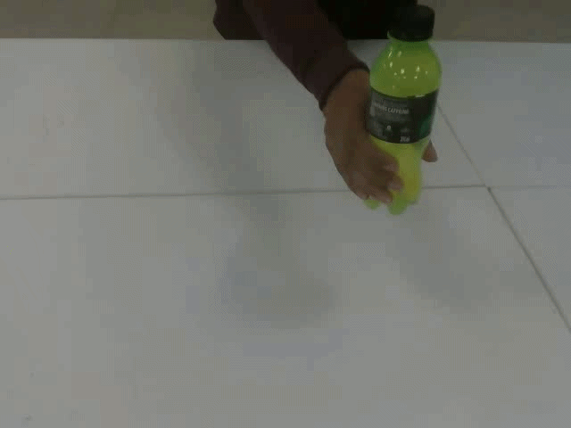 | 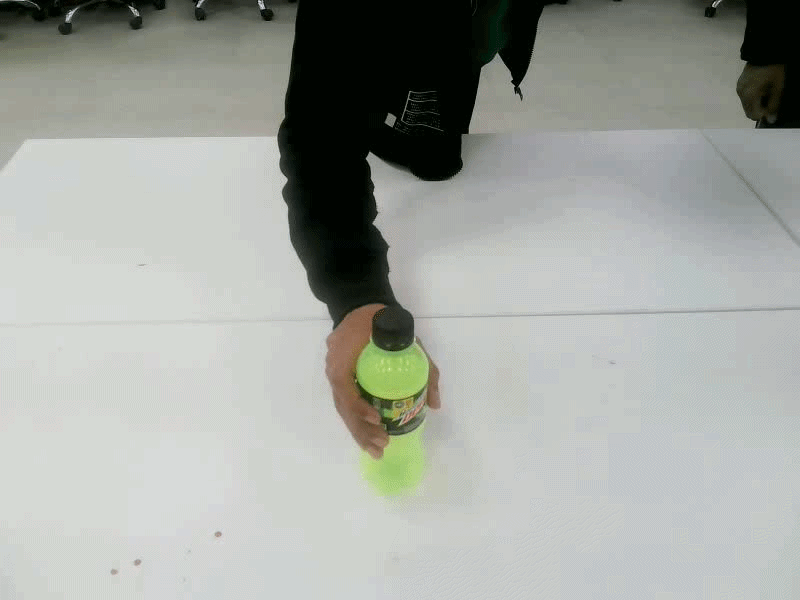 | 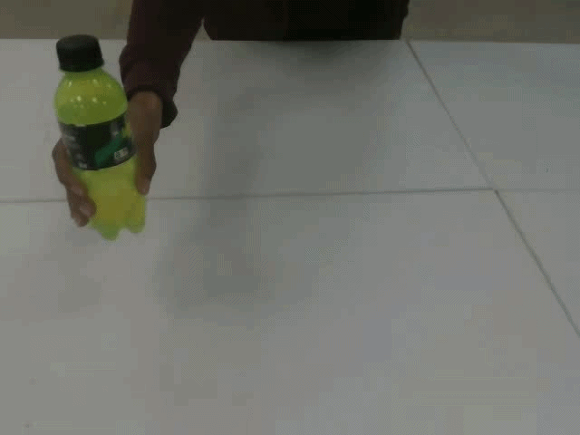 |  |
| **Retract** | **Tilt** | **Wipe** | |
| 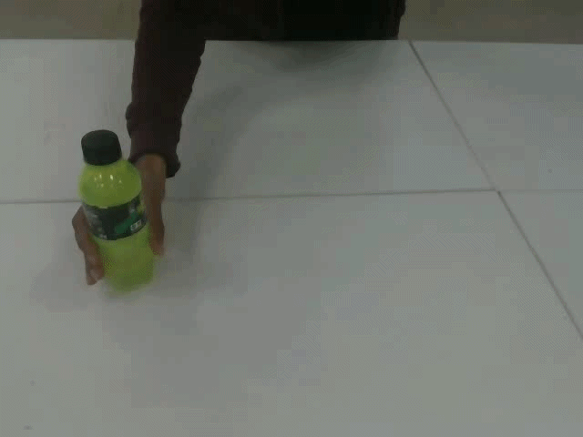 |  |  | |

</div>

---

## Human Demonstrations (at inference time)

Below are sample raw source clips.

<div align="center">

| Pick & Place | Pick & Give |
|:---:|:---:|
|  | 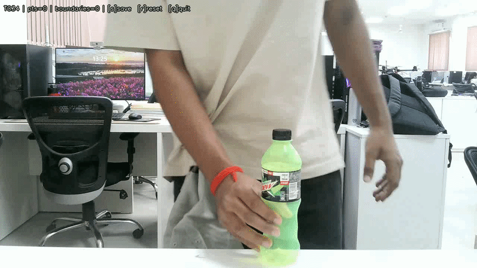 |
| **Pick & Pour** | **Mopping** |
|  | 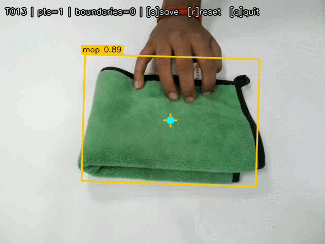 |

</div>

---

## Demo Video

<div align="center">

<!-- TODO: replace VIDEO_ID with your YouTube video ID once uploaded -->
[](https://www.youtube.com/watch?v=VIDEO_ID)

<br><em>▶️ Click to watch the Video2SubAct demo — human demonstration to robot execution.</em>

</div>

> 🎥 **Demo video coming soon** — link will be added here upon release.


---

## Sample Representations

The [`Sample/`](Sample/) folder holds **one example clip per class**, converted by each representation. **Pixel Variance** lights up *where motion happened*, **Mean Image** averages movement into a static ghost, **Middle Frame** keeps a single RGB snapshot, and **Dynamic Image** encodes temporal order via rank pooling.

### Pixel Variance <sub>(ours)</sub>

| Move | Pick | Place | Reach | Retract | Tilt | Wipe |
|:---:|:---:|:---:|:---:|:---:|:---:|:---:|
| 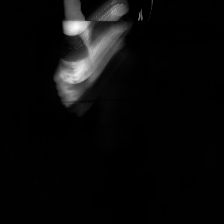 | 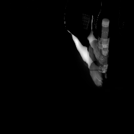 | 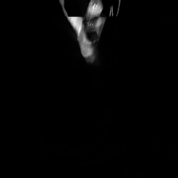 | 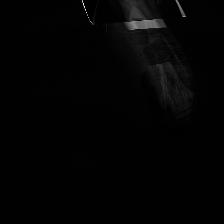 | 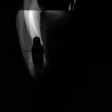 | 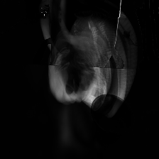 | 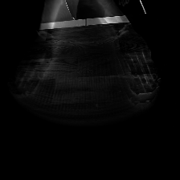 |

### Mean Image

| Move | Pick | Place | Reach | Retract | Tilt | Wipe |
|:---:|:---:|:---:|:---:|:---:|:---:|:---:|
| 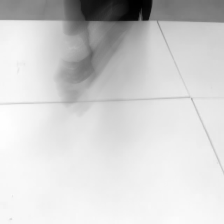 | 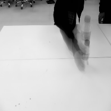 | 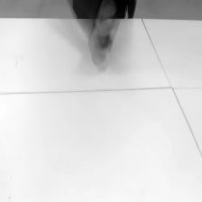 | 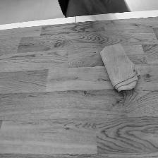 | 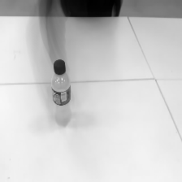 | 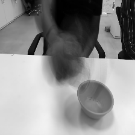 | 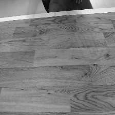 |

### Middle Frame

| Move | Pick | Place | Reach | Retract | Tilt | Wipe |
|:---:|:---:|:---:|:---:|:---:|:---:|:---:|
| 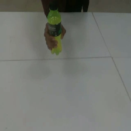 | 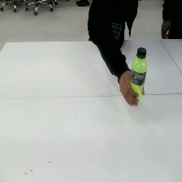 | 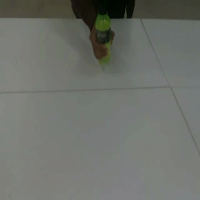 | 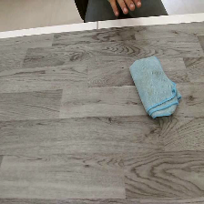 | 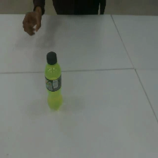 | 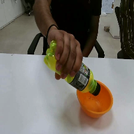 | 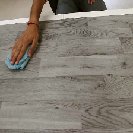 |

### Dynamic Image

| Move | Pick | Place | Reach | Retract | Tilt | Wipe |
|:---:|:---:|:---:|:---:|:---:|:---:|:---:|
| 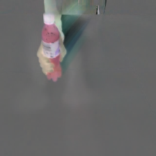 | 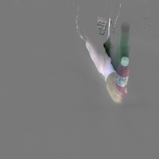 | 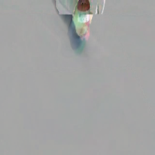 | 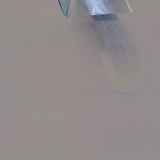 | 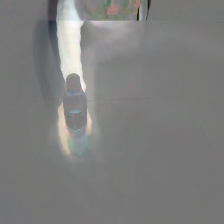 | 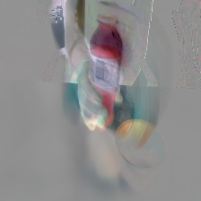 | 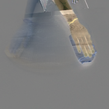 |

---

## Method

<div align="center">
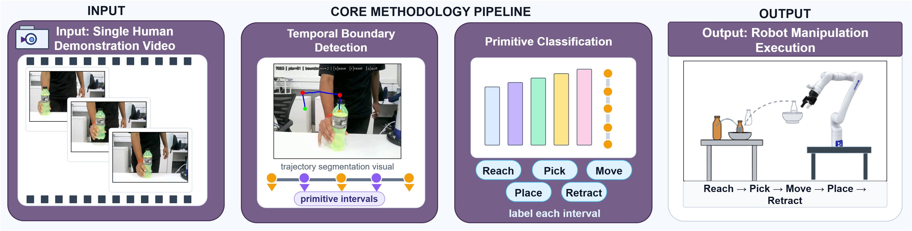
<br><em>A single human demonstration video is segmented by temporal boundary detection into primitive intervals, each interval is classified into an action primitive, and the resulting sequence drives robot manipulation execution.</em>
</div>

<!-- TODO: place the pipeline figure at assets/pipeline.png (or change the src path above) -->

```
video clip ──decode──▶ frames ──temporal reduction──▶ 1 image (224×224×3) ──frozen CNN + head──▶ action label
```

The reduction and the backbone are both **swappable** while the tensor shape stays fixed, enabling two clean, apples-to-apples studies.

| Representation | What it computes | Channels |
|---|---|---|
| **Pixel Variance** <sub>(ours)</sub> | Grayscale temporal variance over all frames, min–max normalized, replicated to 3 channels — bright where pixels changed. | gray → 3ch |
| **Mean Image** | Grayscale temporal mean over all frames — averages motion away. | gray → 3ch |
| **Dynamic Image** | Approximate rank pooling (Bilen et al., TPAMI 2018) — encodes temporal order. | RGB |
| **Middle Frame** | The true RGB middle frame — a static snapshot, no temporal info (baseline). | RGB |

**Classifier head (identical everywhere):**

```
frozen backbone → GlobalAveragePooling2D → LayerNormalization
                → Dense(128, relu) → Dropout(0.5) → Dense(7, softmax)
```

---

## Experimental Protocol

| Setting | Value |
|---|---|
| Classes | 7 (`Move, Pick, Place, Reach, Retract, Tilt, Wipe`) |
| Split | Fixed **70 / 15 / 15** stratified (Train / Val / Test) |
| Seeds | `42, 123, 999, 2025, 777` → reported as **mean ± std** |
| Input size | `224 × 224 × 3` |
| Epochs | **100**, no early stopping, no LR scheduling |
| Optimizer | Adam, LR `1e-4`, batch 12 |
| Checkpoint | best `val_loss` (`save_best_only`) |
| Test eval | **once**, on the untouched test set, best-val checkpoint |
| Augmentation | Train only: Original + Gaussian Blur + Horizontal Flip + Color Jitter |

Backbones are always **frozen** (ImageNet weights, no top); only the head is trained. Test is touched exactly once per seed. Results aggregate as **mean ± std** across five seeds.


---

<p align="center">
  
</p>

> **Note:** Code and pretrained models will be released soon, upon publication.

---

## Dataset

Expects a 7-class layout, one subfolder per class (`Move/ Pick/ Place/ Reach/ Retract/ Tilt/ Wipe/`), each with clips in `.mp4 .avi .mov .mkv .m4v .mpg .mpeg`. Each class needs **≥ 3** videos for a non-degenerate stratified split.


The Dynamic Image baseline follows Bilen et al., *Action Recognition with Dynamic Image Networks*, TPAMI 2018.

---

## License & Contact

Code released under the **MIT License** (see [`LICENSE`](LICENSE)); the dataset is licensed separately for non-commercial research use.

**Dharmendra Sharma** (corresponding author) — `d22194@students.iitmandi.ac.in`
For dataset requests, include your name, affiliation, and intended research use.
